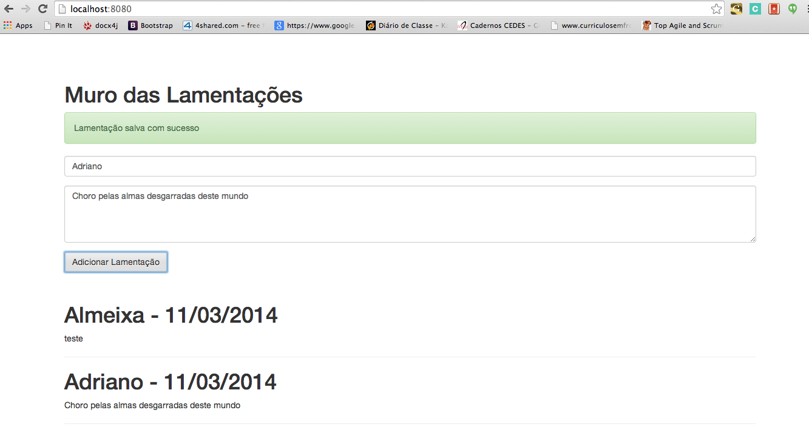

## Template Web NOSQL  ##

This is a template project for web applications with Scala. 

It's a demonstration of Lamentation's Wall(Muro das Lamentações in Portuguese)

###Frameworks
- Scalatra 
- Salat and Cashbah (For MongoDB)
- Google GUICE (DI)

###Dependencies
- You have to have **sbt** installed to compile and test the template application.
- Tou have to have a **MongoDB** instance up and running on your local machine

## Screenshot

